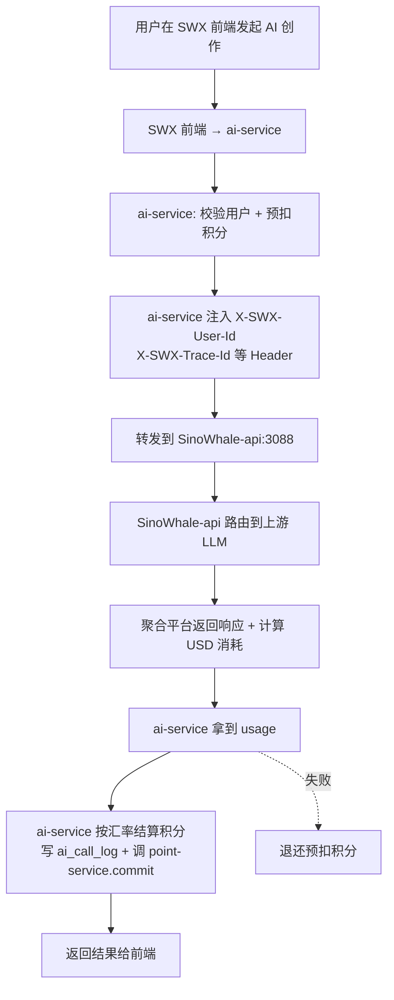
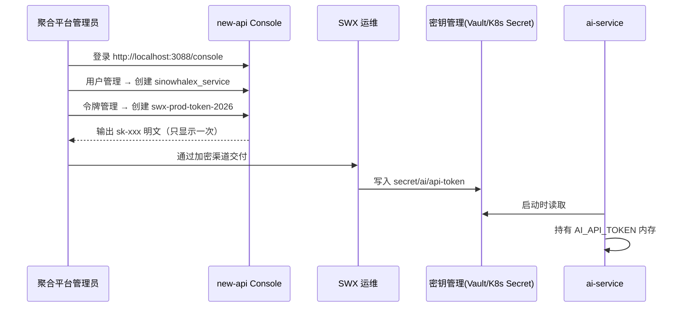
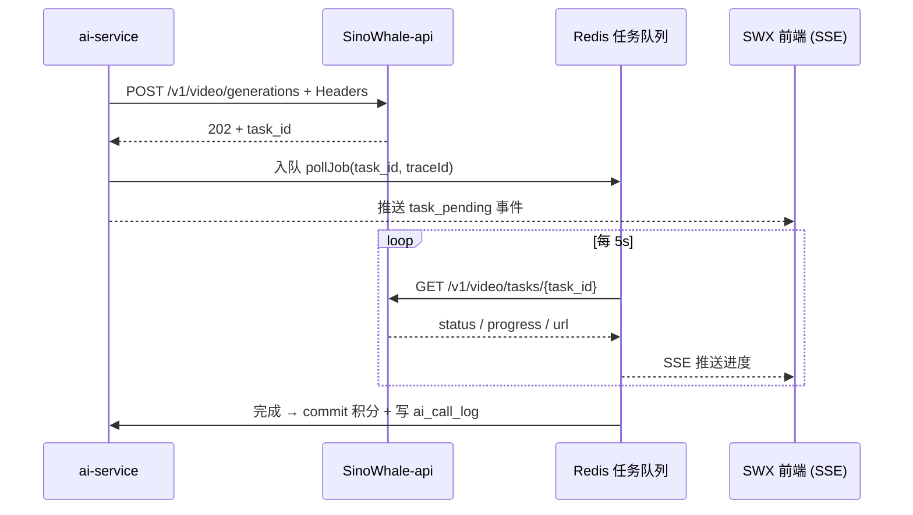
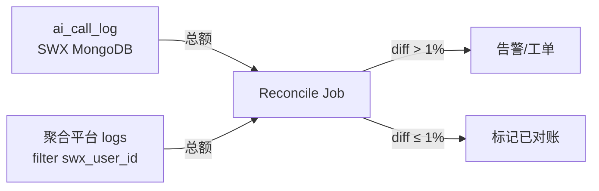
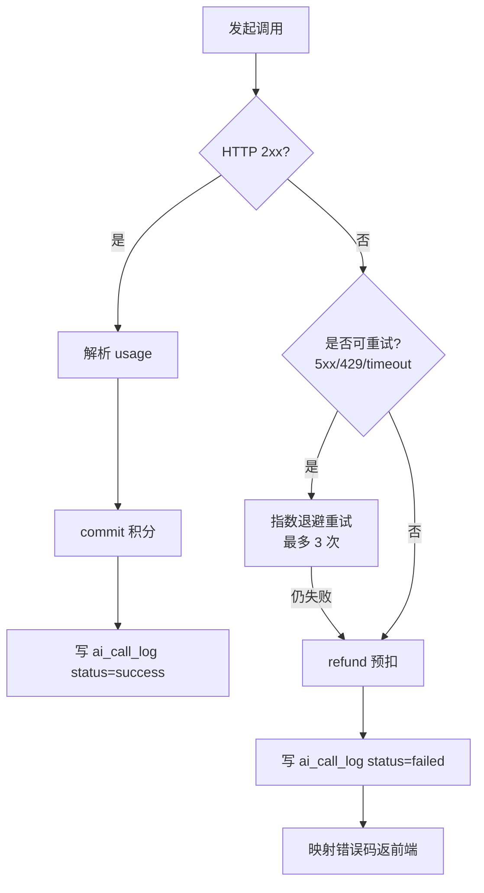
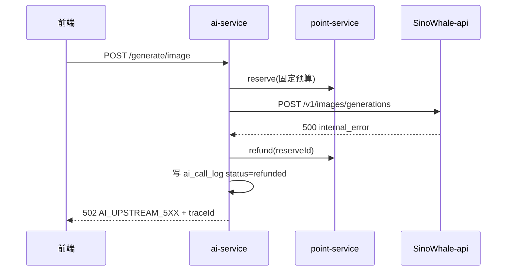
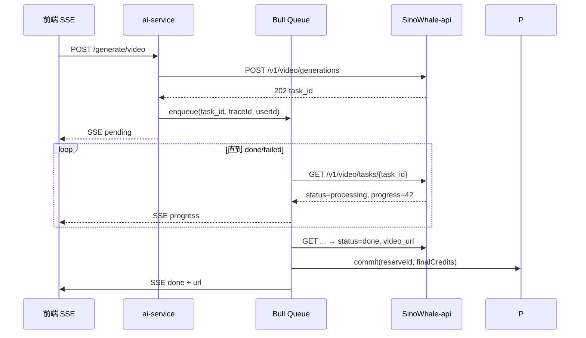

# SinoWhaleX 对接 SinoWhale-api 技术文档

> **文档版本**：v1.0.0
> **生效日期**：2026-06-18
> **文档负责人**：SinoWhaleX 工程组
> **目标读者**：SinoWhaleX 后端工程师（ai-service / user-service / content-service）、QA、SRE、前端
> **关联文档**：《SinoWhale-api 方案C 开发文档》

---

## 目录

- [1. 文档导读](#1-文档导读)
- [2. 对接整体流程概述](#2-对接整体流程概述)
- [3. 开发环境准备](#3-开发环境准备)
- [4. 前置条件](#4-前置条件)
- [5. 认证方式与安全](#5-认证方式与安全)
  - [5.1 服务账号 Token 获取](#51-服务账号-token-获取)
  - [5.2 自定义 Header 注入规范](#52-自定义-header-注入规范)
  - [5.3 Token 刷新与轮转机制](#53-token-刷新与轮转机制)
  - [5.4 安全注意事项](#54-安全注意事项)
- [6. 分功能模块对接指南](#6-分功能模块对接指南)
  - [6.1 文本生成对接](#61-文本生成对接)
  - [6.2 图像生成对接](#62-图像生成对接)
  - [6.3 视频生成对接](#63-视频生成对接)
  - [6.4 用户调用记录查询](#64-用户调用记录查询)
- [7. 数据交互标准](#7-数据交互标准)
- [8. 错误处理机制](#8-错误处理机制)
- [9. 代码示例（TypeScript / Python）](#9-代码示例typescript--python)
- [10. 对接流程图](#10-对接流程图)
- [11. 测试用例](#11-测试用例)
- [12. 集成验收标准](#12-集成验收标准)
- [13. 常见问题与调试方法](#13-常见问题与调试方法)
- [14. 索引](#14-索引)
- [15. 术语表](#15-术语表)

---

## 1. 文档导读

### 1.1 适用范围

本指南指导 **SinoWhaleX `services/ai-service`** 团队完成与 **SinoWhale-api（聚合平台，端口 3088）** 的对接。包含：

- 服务账号 Token 配置
- 自定义 Header 注入策略（方案C）
- 三类 AI 功能（文本/图像/视频）的调用闭环
- 与 SinoWhaleX 内部 `point-service`、`ai_call_log` 表的对账衔接

### 1.2 不在范围

- SinoWhale-api 内部代码改造（见《SinoWhale-api 方案C 开发文档》）
- 前端 UI（仅给出后端 API 契约）
- 计费费率配置（聚合平台后台 UI 操作）

### 1.3 关键设计原则

| 原则 | 说明 |
|------|------|
| **服务账号唯一**：所有 SWX 用户共用一个聚合平台 sk-Token | 简化对账 |
| **用户身份通过 Header 传递**：`X-SWX-User-Id` | 不破坏聚合平台用户体系 |
| **积分以 SWX 为权威**：聚合平台美元额度仅供对账参考 | 单一事实源 |
| **预扣 + 终结**：调用前预扣积分，回调/响应后按实际 token 结算 | 防超扣 |

---

## 2. 对接整体流程概述



### 2.1 关键里程碑

| 阶段 | 交付物 | 验证 |
|------|--------|------|
| M1：环境与配置 | `.env.production` 配 `AI_API_BASE_URL` `AI_API_TOKEN` | curl 通 `/v1/models` |
| M2：文本生成接通 | `textGenerator.ts` 改造完成 | 端到端 200 + 积分扣减正确 |
| M3：图像生成接通 | `imageGenerator.ts` | 同上 |
| M4：视频生成接通 | `videoGenerator.ts` | 同上 |
| M5：日志对账 | 跑通定时对账 Job | SWX vs 聚合平台总额误差 < 1% |
| M6：上线 | 灰度 5% → 100% | SLA 达标 |

---

## 3. 开发环境准备

### 3.1 软件依赖

| 软件 | 版本 | 用途 |
|------|------|------|
| Node.js | ≥ 20.x LTS | ai-service 运行时 |
| pnpm 或 npm | latest | 包管理 |
| Docker | ≥ 24.x | 本地启动 SinoWhale-api |
| MongoDB | ≥ 6.x | ai-service 数据 |
| Redis | ≥ 7.x | 任务队列 / SSE |
| TypeScript | ≥ 5.x | 编译 |

### 3.2 启动 SinoWhale-api（本地）

```powershell
cd e:\Code\SinoWhale-api
docker-compose up -d
# 验证：访问 http://localhost:3088
```

### 3.3 启动 SinoWhaleX ai-service

```powershell
cd E:\MyProject\SinoWhaleX\services\ai-service
pnpm install
pnpm run dev
# 默认端口 3003（来自 src/config/env.ts）
```

### 3.4 环境变量

在 SinoWhaleX 根 `.env`（或 `services/ai-service/.env.local`）追加：

```env
# 聚合平台对接
AI_API_BASE_URL=http://localhost:3088
AI_API_TOKEN=sk-sinowhalex-xxxxxxxxxxxxxxxxxxxxxxxxxxxxxxxx
AI_API_TIMEOUT_MS=120000
AI_API_GROUP=sinowhalex          # 在聚合平台后台预先创建的 group

# 积分汇率（USD → credits），1 USD = 100 credits 示例
AI_USD_TO_CREDITS=100

# 对账定时任务
AI_RECONCILE_CRON="0 */1 * * *"  # 每小时一次

# 方案C 开关（联调阶段必开）
AI_INJECT_SWX_HEADERS=true
```

> ⚠️ `AI_API_TOKEN` 不得提交到代码仓库，必须走 `.env.example` 占位 + Vault/K8s Secret 注入。

---

## 4. 前置条件

### 4.1 聚合平台后台配置（一次性）

由聚合平台管理员在 `http://localhost:3088/console` 完成：

1. **创建分组**：`sinowhalex`，绑定全部上游通道
2. **创建用户**（服务账号）：`sinowhalex_service`，role = `common_user`
3. **创建 Token**：
   - 名称：`swx-prod-token-2026`
   - 分组：`sinowhalex`
   - 额度：`unlimited` 或预设
   - 模型限制：按业务白名单
   - IP 限制：SWX 后端出口 IP
4. **方案C 总开关**：在 `.env` 设置 `SWX_HEADER_ENABLED=true`

### 4.2 SinoWhaleX 侧前置

- `user-service` 提供 `getUserById(userId)` 内部接口
- `point-service` 提供：
  - `POST /internal/points/reserve` 预扣
  - `POST /internal/points/commit` 终结
  - `POST /internal/points/refund` 退还
- 数据库中创建 `ai_call_log` 集合（见 [7.3](#73-ai_call_log-数据模型)）

---

## 5. 认证方式与安全

### 5.1 服务账号 Token 获取

#### 5.1.1 流程



#### 5.1.2 Token 字段说明

| 字段 | 在 SWX 侧的位置 | 必填 |
|------|---------------|------|
| Token Key（`sk-xxx`） | `env.AI_API_TOKEN` | ✅ |
| 关联分组 | `env.AI_API_GROUP` | ✅ |
| 过期时间 | 监控告警，不入代码 | - |

### 5.2 自定义 Header 注入规范

每次调用聚合平台必须注入以下 Header（如启用方案C）：

| Header | 值来源 | 示例 |
|--------|-------|------|
| `Authorization` | `Bearer ${AI_API_TOKEN}` | `Bearer sk-xxx` |
| `X-SWX-User-Id` | 当前登录用户 `req.user.id` | `user_64f0a1b2c3d4e5` |
| `X-SWX-Trace-Id` | `nanoid()` 或入口请求 traceId | `swx-2026-06-18-abc123` |
| `X-SWX-Biz-Type` | 调用入口枚举 | `text` / `image` / `video` |
| `X-SWX-Request-Id` | UUID v4 | `8a1f4e2c-...` |

**严禁**：
- ❌ 直接透传前端 Header（必须服务端重写）
- ❌ 在 `X-SWX-User-Id` 中放邮箱、手机号等 PII
- ❌ 包含 ASCII 字母数字 `-` `_` 之外的字符

### 5.3 Token 刷新与轮转机制

聚合平台 Token 默认不自动过期，但出于安全考虑，制定如下轮转策略：

| 场景 | 频率 | 操作 |
|------|------|------|
| 常规轮转 | 每 90 天 | 创建新 Token → Vault 双写 → 滚动重启 → 删除旧 Token |
| 应急轮转（泄漏） | 立即 | 聚合平台后台禁用旧 Token → 紧急写入 Vault → 重启 |
| 灰度切换 | 每次发版 | 通过 `AI_API_TOKEN_FALLBACK` 双 Token 探活 |

#### 5.3.1 双 Token 平滑切换示例

```typescript
// services/ai-service/src/services/aiApiClient.ts
const tokens = [env.AI_API_TOKEN, env.AI_API_TOKEN_FALLBACK].filter(Boolean);
let activeIdx = 0;

async function callWithRotation(fn: (t: string) => Promise<Response>) {
  for (let i = 0; i < tokens.length; i++) {
    const idx = (activeIdx + i) % tokens.length;
    const res = await fn(tokens[idx]);
    if (res.status !== 401) {
      activeIdx = idx;
      return res;
    }
  }
  throw new Error('AI_API_TOKEN_ALL_INVALID');
}
```

### 5.4 安全注意事项

| 风险 | 防护 |
|------|------|
| Token 泄漏到日志 | 全局 logger 脱敏 `Authorization: Bearer ***` |
| 客户端伪造 X-SWX-User-Id | 必须以 `req.user.id`（来自 SWX JWT 认证）覆盖 |
| 跨用户 Trace 串扰 | Trace-Id 含用户 ID 前缀 + 随机串 |
| 上游 LLM 拿到 SWX 信息 | 由 SinoWhale-api 保证不向上游透传（见 SinoWhale-api 方案C 文档 §4.2.2） |
| MITM | 生产环境聚合平台必须 HTTPS（nginx 反代） |

---

## 6. 分功能模块对接指南

### 6.1 文本生成对接

#### 6.1.1 对接位置

[`E:\MyProject\SinoWhaleX\services\ai-service\src\services\textGenerator.ts`](file:///E:/MyProject/SinoWhaleX/services/ai-service/src/services/textGenerator.ts)

#### 6.1.2 上游协议

聚合平台暴露 OpenAI Compatible：`POST /v1/chat/completions`

#### 6.1.3 步骤

1. **入参校验**：用户 ID、模型名、prompt 长度
2. **预估 token**：使用 `tiktoken` 估算（用于预扣积分）
3. **预扣积分**：调用 `point-service.reserve(userId, estimatedCredits)`
4. **构造请求**：注入 Headers + body
5. **调用聚合平台**
6. **解析 usage**：从响应 `usage.prompt_tokens / completion_tokens` 取值
7. **计算 USD → credits**：`credits = ceil(usd × AI_USD_TO_CREDITS)`
8. **结算积分**：`point-service.commit(reserveId, actualCredits)`
9. **写 ai_call_log**

#### 6.1.4 请求/响应示例

**请求**：

```http
POST /v1/chat/completions HTTP/1.1
Host: localhost:3088
Authorization: Bearer sk-sinowhalex-xxx
Content-Type: application/json
X-SWX-User-Id: user_64f0a1b2c3d4e5
X-SWX-Trace-Id: swx-text-20260618-001
X-SWX-Biz-Type: text
X-SWX-Request-Id: 8a1f4e2c-9d6b-4a7e-b3c1-1d9e5f0a8c2d

{
  "model": "gpt-4o-mini",
  "messages": [
    {"role": "system", "content": "你是诗歌助手"},
    {"role": "user", "content": "写一首关于鲸鱼的七言绝句"}
  ],
  "stream": false,
  "max_tokens": 200
}
```

**响应**：

```json
{
  "id": "chatcmpl-XXXX",
  "object": "chat.completion",
  "model": "gpt-4o-mini",
  "choices": [{
    "index": 0,
    "message": {"role": "assistant", "content": "..."},
    "finish_reason": "stop"
  }],
  "usage": {
    "prompt_tokens": 23,
    "completion_tokens": 86,
    "total_tokens": 109
  }
}
```

> 计费换算示例：`gpt-4o-mini` 输入 $0.15/M，输出 $0.6/M
> USD = 23/1e6 × 0.15 + 86/1e6 × 0.6 ≈ $0.0000550
> credits = ceil(0.0000550 × 100 × 1000)（按需调整精度）

### 6.2 图像生成对接

#### 6.2.1 对接位置

[`E:\MyProject\SinoWhaleX\services\ai-service\src\services\imageGenerator.ts`](file:///E:/MyProject/SinoWhaleX/services/ai-service/src/services/imageGenerator.ts)

#### 6.2.2 上游协议

`POST /v1/images/generations`

#### 6.2.3 关键差异

| 维度 | 文本 | 图像 |
|------|------|------|
| 计费基准 | token | 按张 + 分辨率 |
| 预扣 | 估算 token | 按尺寸预算固定积分 |
| 响应 | usage 字段 | `data[0].b64_json` 或 url + `usage` |
| 时长 | 1~10 s | 5~30 s |

#### 6.2.4 请求示例

```http
POST /v1/images/generations HTTP/1.1
Authorization: Bearer sk-sinowhalex-xxx
X-SWX-User-Id: user_64f0a1b2c3d4e5
X-SWX-Trace-Id: swx-img-20260618-002
X-SWX-Biz-Type: image
Content-Type: application/json

{
  "model": "dall-e-3",
  "prompt": "A whale swimming in cosmos, hyperrealistic",
  "n": 1,
  "size": "1024x1024",
  "response_format": "url"
}
```

### 6.3 视频生成对接

#### 6.3.1 对接位置

[`E:\MyProject\SinoWhaleX\services\ai-service\src\services\videoGenerator.ts`](file:///E:/MyProject/SinoWhaleX/services/ai-service/src/services/videoGenerator.ts)

#### 6.3.2 上游协议（异步任务）

```
POST /v1/video/generations    → 返回 task_id
GET  /v1/video/tasks/{task_id} → 查询状态
```

或聚合平台 task 协议：`/v1/jimeng/`、`/v1/hailuo/` 等。具体以聚合平台 `relay/channel/task/` 下实际 adaptor 为准。

#### 6.3.3 异步流程



#### 6.3.4 注意

- 必须将 `X-SWX-Trace-Id` 持久化到任务队列，轮询查询时 **同样注入** 同一 Trace-Id 用于对账
- 失败必须退还预扣积分 + 推送 `task_failed` 给前端

### 6.4 用户调用记录查询

调用聚合平台 `/api/log/?swx_user_id=xxx`，需先用管理员 access_token 登录或使用专用查询账号。

> 一般情况下 SWX 自身已记录 `ai_call_log`，不必跨平台查询；仅作运维兜底。

---

## 7. 数据交互标准

### 7.1 通用请求规范

| 项 | 要求 |
|----|------|
| Content-Type | `application/json; charset=utf-8` |
| 编码 | UTF-8 |
| body 大小 | ≤ 8 MB（图像 base64 上传场景 ≤ 16 MB） |
| 超时 | 默认 120 s，视频任务接口 ≤ 30 s（仅创建） |
| Keep-Alive | 启用（连接池） |

### 7.2 字段命名/校验规则

| 字段 | 类型 | 校验规则 |
|------|------|---------|
| `model` | string | 在白名单内：`AI_ALLOWED_MODELS` |
| `messages[].content` | string | 长度 ≤ 16 KB |
| `prompt`（图像） | string | 长度 ≤ 4000 |
| `n`（图像） | integer | 1~4 |
| `size`（图像） | enum | `512x512` / `1024x1024` / `1792x1024` 等 |
| `X-SWX-User-Id` | string | 正则 `^[A-Za-z0-9_-]{1,128}$` |
| `X-SWX-Trace-Id` | string | 同上 |

### 7.3 ai_call_log 数据模型

存于 SinoWhaleX MongoDB（ai-service 库），用于对账：

```typescript
// services/ai-service/src/models/AiCallLog.ts
import { Schema, model } from 'mongoose';

const AiCallLogSchema = new Schema({
  userId:         { type: String, required: true, index: true },
  traceId:        { type: String, required: true, unique: true },
  bizType:        { type: String, enum: ['text','image','video'], required: true },
  model:          { type: String, required: true },
  upstreamLogId:  { type: String, index: true },        // 聚合平台 logs.id（如能取到）
  promptTokens:   { type: Number, default: 0 },
  completionTokens: { type: Number, default: 0 },
  imageCount:     { type: Number, default: 0 },
  videoSeconds:   { type: Number, default: 0 },
  costUsd:        { type: Number, required: true },     // 聚合平台口径
  reservedCredits:{ type: Number, required: true },     // 预扣
  finalCredits:   { type: Number, required: true },     // 终结
  status:         { type: String, enum: ['success','failed','refunded'], required: true },
  errorMessage:   { type: String },
  createdAt:      { type: Date, default: Date.now, index: true },
}, { timestamps: true });

AiCallLogSchema.index({ userId: 1, createdAt: -1 });

export const AiCallLog = model('AiCallLog', AiCallLogSchema);
```

### 7.4 对账数据流



---

## 8. 错误处理机制

### 8.1 错误码定义（聚合平台 → SWX 映射）

| HTTP | 聚合平台 code | SWX 内部 code | 含义 | 处理 |
|------|--------------|--------------|------|------|
| 400 | `bad_request` | `AI_BAD_REQUEST` | 参数错误 | 返回前端 |
| 401 | `token_invalid` | `AI_TOKEN_INVALID` | sk 失效 | 告警 + 立即轮转 |
| 403 | `quota_exhausted` | `AI_QUOTA_EXHAUSTED` | 聚合平台额度耗尽 | 告警 + 充值 |
| 403 | `model_not_allowed` | `AI_MODEL_NOT_ALLOWED` | 分组限制 | 检查 group 配置 |
| 429 | `rate_limit_exceeded` | `AI_RATE_LIMIT` | 限流 | 退避重试（指数退避，最多 3 次） |
| 500 | `internal_error` | `AI_UPSTREAM_5XX` | 上游 LLM 故障 | 退还积分 + 重试 1 次 |
| 504 | `gateway_timeout` | `AI_TIMEOUT` | 超时 | 退还积分 |

### 8.2 异常处理流程



### 8.3 恢复策略

| 场景 | 策略 |
|------|------|
| 聚合平台短暂不可用（≤ 1 min） | 队列堆积、重试 |
| 聚合平台长时间不可用（> 5 min） | 熔断（circuit breaker），AI 创作入口降级显示"维护中" |
| 单个 Trace 超时但任务可能已成功 | 通过 `traceId` 去重查询 `/api/log/?swx_trace_id=xxx`，避免重复扣费 |
| 数据不一致（积分扣了但聚合平台无记录） | 凌晨对账 Job 自动补退 |

---

## 9. 代码示例（TypeScript / Python）

### 9.1 TypeScript（生产用，集成到 ai-service）

```typescript
// services/ai-service/src/services/aiApiClient.ts
import { env } from '../config/env';
import { nanoid } from 'nanoid';

export interface CallContext {
  userId: string;
  bizType: 'text' | 'image' | 'video';
  traceId?: string;
  requestId?: string;
}

function buildHeaders(ctx: CallContext): HeadersInit {
  const headers: Record<string, string> = {
    'Authorization': `Bearer ${env.AI_API_TOKEN}`,
    'Content-Type': 'application/json',
  };
  if (env.AI_INJECT_SWX_HEADERS) {
    headers['X-SWX-User-Id']    = sanitize(ctx.userId);
    headers['X-SWX-Trace-Id']   = sanitize(ctx.traceId ?? `swx-${Date.now()}-${nanoid(8)}`);
    headers['X-SWX-Biz-Type']   = ctx.bizType;
    headers['X-SWX-Request-Id'] = sanitize(ctx.requestId ?? nanoid());
  }
  return headers;
}

function sanitize(v: string): string {
  // 仅保留合法字符，与聚合平台 safeHeader 对齐
  return v.replace(/[^A-Za-z0-9_-]/g, '').slice(0, 128);
}

export async function chatCompletion(
  body: object,
  ctx: CallContext,
): Promise<Response> {
  const url = `${env.AI_API_BASE_URL}/v1/chat/completions`;
  const ctrl = new AbortController();
  const timer = setTimeout(() => ctrl.abort(), env.AI_API_TIMEOUT_MS);
  try {
    return await fetch(url, {
      method: 'POST',
      headers: buildHeaders(ctx),
      body: JSON.stringify(body),
      signal: ctrl.signal,
    });
  } finally {
    clearTimeout(timer);
  }
}
```

```typescript
// services/ai-service/src/services/textGenerator.ts (核心片段)
import { chatCompletion } from './aiApiClient';
import { reserveCredits, commitCredits, refundCredits } from './pointClient';
import { AiCallLog } from '../models/AiCallLog';
import { nanoid } from 'nanoid';
import { estimateTokens } from './tokenEstimator';

export async function generateText(params: {
  userId: string;
  model: string;
  messages: any[];
}) {
  const traceId = `swx-text-${Date.now()}-${nanoid(8)}`;
  const estimated = estimateTokens(params.messages);
  const reserveCredit = Math.ceil(estimated * 0.5);  // 估算系数

  const reserveId = await reserveCredits(params.userId, reserveCredit, traceId);

  try {
    const res = await chatCompletion(
      { model: params.model, messages: params.messages },
      { userId: params.userId, bizType: 'text', traceId },
    );
    if (!res.ok) throw mapHttpError(res);
    const data = await res.json();

    const usd = computeUsd(params.model, data.usage);
    const finalCredits = Math.ceil(usd * env.AI_USD_TO_CREDITS);
    await commitCredits(reserveId, finalCredits);

    await AiCallLog.create({
      userId: params.userId,
      traceId,
      bizType: 'text',
      model: params.model,
      promptTokens: data.usage.prompt_tokens,
      completionTokens: data.usage.completion_tokens,
      costUsd: usd,
      reservedCredits: reserveCredit,
      finalCredits,
      status: 'success',
    });

    return data;
  } catch (e: any) {
    await refundCredits(reserveId);
    await AiCallLog.create({
      userId: params.userId, traceId, bizType: 'text',
      model: params.model, costUsd: 0,
      reservedCredits: reserveCredit, finalCredits: 0,
      status: 'failed', errorMessage: e.message,
    });
    throw e;
  }
}
```

### 9.2 Python（用于运维脚本与压测）

```python
# tools/ai_api_smoke.py
import os, requests, uuid, time

BASE = os.environ["AI_API_BASE_URL"]
TOKEN = os.environ["AI_API_TOKEN"]

def call_chat(user_id: str, prompt: str, model: str = "gpt-4o-mini"):
    headers = {
        "Authorization": f"Bearer {TOKEN}",
        "Content-Type": "application/json",
        "X-SWX-User-Id":    user_id,
        "X-SWX-Trace-Id":   f"swx-py-{int(time.time())}-{uuid.uuid4().hex[:8]}",
        "X-SWX-Biz-Type":   "text",
        "X-SWX-Request-Id": str(uuid.uuid4()),
    }
    body = {
        "model": model,
        "messages": [{"role": "user", "content": prompt}],
        "max_tokens": 200,
    }
    r = requests.post(f"{BASE}/v1/chat/completions",
                      headers=headers, json=body, timeout=120)
    r.raise_for_status()
    return r.json()

if __name__ == "__main__":
    res = call_chat("user_smoke_001", "Hello whale!")
    print(res["choices"][0]["message"]["content"])
    print("usage:", res["usage"])
```

---

## 10. 对接流程图

### 10.1 文本生成端到端（正常路径）

```mermaid
sequenceDiagram
    participant U as 用户
    participant FE as SWX 前端
    participant AI as ai-service
    participant P as point-service
    participant API as SinoWhale-api
    participant LLM as 上游 LLM
    participant DB as MongoDB ai_call_log

    U->>FE: 提交 prompt
    FE->>AI: POST /generate/text {userId, prompt}
    AI->>AI: estimate tokens / reserveCredit
    AI->>P: reserve(userId, reserveCredit, traceId)
    P-->>AI: reserveId
    AI->>API: POST /v1/chat/completions<br/>+ X-SWX-* Headers
    API->>LLM: 转发
    LLM-->>API: 响应 + usage
    API-->>AI: 200 + body
    AI->>AI: usd = compute(usage); credits = usd * rate
    AI->>P: commit(reserveId, credits)
    AI->>DB: insert log status=success
    AI-->>FE: 文本结果
    FE-->>U: 渲染
```

### 10.2 图像生成（含失败退款）



### 10.3 视频异步任务



---

## 11. 测试用例

### 11.1 集成测试（Jest + supertest）

| 用例 ID | 场景 | 输入 | 预期 | 验证方式 |
|--------|------|------|------|---------|
| IT-AI-01 | 文本生成成功 | userId=u1, prompt="hi" | 200 + ai_call_log.status=success + 积分扣减 = ceil(usd*100) | DB 断言 |
| IT-AI-02 | 文本生成 401 | TOKEN 错误 | refund 全额 + status=failed | DB + point 断言 |
| IT-AI-03 | 文本超时 | mock 聚合平台 sleep 130s | refund + AI_TIMEOUT | DB + 时长 < 125s |
| IT-AI-04 | 图像 1024×1024 | prompt 合法 | 200 + image_count=1 + 扣减按张 | DB 断言 |
| IT-AI-05 | 图像 prompt 5000 字超限 | size > 4000 | 400 AI_BAD_REQUEST，**不发起上游调用** | mock 断言 |
| IT-AI-06 | 视频任务正常完成 | 5 秒视频 | SSE 收到 progress→done，credit 与 USD 匹配 | E2E |
| IT-AI-07 | 视频任务失败 | mock task_failed | refund + SSE failed | DB |
| IT-AI-08 | Header 注入校验 | userId 含 `<script>` | sanitize 后落库为空字符串过滤 | header 断言 |
| IT-AI-09 | 并发 50 路 | 不同 userId | 每条 ai_call_log 一一对应 | 抽样校验 |
| IT-AI-10 | 对账 Job | 24h 数据 | SWX 总额 vs API 总额 diff < 1% | report |

### 11.2 单元测试

| 用例 | 文件 | 关注点 |
|------|------|-------|
| `sanitize()` 各类输入 | `aiApiClient.test.ts` | 字符过滤、长度截断 |
| `buildHeaders()` 关闭注入开关 | 同上 | 仅保留 Authorization |
| `computeUsd()` 各模型 | `pricing.test.ts` | 价格表正确 |
| `mapHttpError()` 各 HTTP code | `errorMapper.test.ts` | 完整映射表 |

### 11.3 验证示例

```typescript
// services/ai-service/src/__tests__/textGenerator.it.test.ts
it('IT-AI-01: 文本生成成功', async () => {
  const res = await app.inject({
    method: 'POST',
    url: '/generate/text',
    headers: { Authorization: `Bearer ${userJwt}` },
    payload: { model: 'gpt-4o-mini', messages: [{ role: 'user', content: 'hi' }] },
  });
  expect(res.statusCode).toBe(200);

  const log = await AiCallLog.findOne({ userId: 'u1' }).sort({ createdAt: -1 });
  expect(log).toBeTruthy();
  expect(log!.status).toBe('success');
  expect(log!.finalCredits).toBeGreaterThan(0);

  const balance = await getUserBalance('u1');
  expect(balance).toBe(initialBalance - log!.finalCredits);
});
```

---

## 12. 集成验收标准

### 12.1 功能验收

- [ ] V-1：文本/图像/视频三种 AI 创作场景端到端跑通
- [ ] V-2：每次调用必产生唯一 traceId，且与聚合平台 logs.other.swx_trace_id 匹配
- [ ] V-3：所有失败路径都正确退款（无残留预扣）
- [ ] V-4：每条 ai_call_log 必能在 `/api/log/?swx_trace_id=xxx` 找到对应记录

### 12.2 性能验收

| 指标 | 目标 |
|------|------|
| 文本生成 P95 | < 6 s |
| 图像生成 P95 | < 25 s |
| ai-service 自身开销 | < 50 ms（除上游调用） |
| 50 并发稳定运行 | 0 异常 / 5 分钟 |

### 12.3 对账验收

- [ ] V-5：连续 7 天对账 diff < 1%
- [ ] V-6：对账失败时告警可达运维群

### 12.4 验收步骤

1. 在预发环境部署 ai-service + 聚合平台（端口 3088）
2. 配置 `AI_INJECT_SWX_HEADERS=true`、`SWX_HEADER_ENABLED=true`
3. 跑完 IT-AI-01 ~ IT-AI-10 全部用例
4. 24h 灰度（5%流量）→ 检查 ai_call_log 与 logs 对账
5. 通过后切 50% → 100%

---

## 13. 常见问题与调试方法

### 13.1 调试工具推荐

| 工具 | 用途 |
|------|------|
| **Bruno** / **Insomnia** | 手工请求 `/v1/*` 验证 Headers |
| **Wireshark / mitmproxy** | 抓包验证上游 LLM 不含 X-SWX-* |
| **MongoDB Compass** | 查 `ai_call_log` |
| **聚合平台 Console**（`http://localhost:3088/console`） | `/log` 页面按 `swx_user_id` 过滤 |
| **k6 / wrk** | 压测 |

### 13.2 FAQ

#### Q1：调用 `/v1/chat/completions` 返回 401 token_invalid

**排查**：
1. `echo $env:AI_API_TOKEN`（PowerShell）确认非空
2. 聚合平台 Console 检查 token 是否被禁用
3. 检查 token 是否限制 IP，当前 SWX 出口 IP 是否在白名单
4. 验证：`curl -H "Authorization: Bearer $env:AI_API_TOKEN" http://localhost:3088/v1/models`

#### Q2：调用成功但聚合平台日志不显示 swx_user_id

**排查**：
1. 聚合平台 `.env` 确认 `SWX_HEADER_ENABLED=true`
2. SWX 侧确认 `AI_INJECT_SWX_HEADERS=true`
3. 抓包确认请求实际发送了 `X-SWX-User-Id`
4. 检查 user_id 是否仅含合法字符（字母数字 `_-`）

#### Q3：积分扣减与聚合平台 USD 不一致

**排查**：
1. 检查 `AI_USD_TO_CREDITS` 配置
2. 在 ai-service 日志查 `costUsd` 字段
3. 查聚合平台 logs 表 `quota` 与 `model_ratio`，复算一遍
4. 跑对账脚本 `tools/reconcile.ts --traceId=xxx`

#### Q4：视频任务长时间 pending

**排查**：
1. 聚合平台 Console `/task` 页面查 task 状态
2. 检查 Bull 队列 `ai-video-poll` 是否在运行
3. 直接 `GET /v1/video/tasks/{task_id}` 手工查询

#### Q5：高并发时 401 偶发

**怀疑**：Token 被吊销或限流。检查聚合平台 `rate-limit` 配置、并行启用 `AI_API_TOKEN_FALLBACK` 双 Token。

### 13.3 日志关键字检索

```powershell
# ai-service 侧
docker logs swx-ai-service | Select-String "X-SWX-Trace-Id"

# 聚合平台侧
docker logs sinowhale-api | Select-String "swx_user_id"
```

---

## 14. 索引

| 关键词 | 章节 |
|-------|------|
| 端口 3088 | [3.2](#32-启动-sinowhale-api本地) |
| 服务账号 | [4.1](#41-聚合平台后台配置一次性) |
| 自定义 Header | [5.2](#52-自定义-header-注入规范) |
| Token 轮转 | [5.3](#53-token-刷新与轮转机制) |
| 文本生成 | [6.1](#61-文本生成对接) |
| 图像生成 | [6.2](#62-图像生成对接) |
| 视频生成 | [6.3](#63-视频生成对接) |
| ai_call_log 模型 | [7.3](#73-ai_call_log-数据模型) |
| 错误码映射 | [8.1](#81-错误码定义聚合平台--swx-映射) |
| TypeScript 示例 | [9.1](#91-typescript生产用集成到-ai-service) |
| Python 示例 | [9.2](#92-python用于运维脚本与压测) |
| 流程图 | [10](#10-对接流程图) |
| 测试用例 | [11](#11-测试用例) |
| 验收标准 | [12](#12-集成验收标准) |
| FAQ | [13.2](#132-faq) |

---

## 15. 术语表

| 术语 | 全称/英文 | 含义 |
|------|----------|------|
| SWX | SinoWhaleX | 业务平台 |
| ai-service | - | SinoWhaleX 微服务，负责对接 AI 能力 |
| point-service | - | 积分服务，提供 reserve/commit/refund |
| 聚合平台 | SinoWhale-api / new-api | 多 LLM 路由 + 计费网关 |
| 服务账号 | Service Account | 聚合平台单一对外账号 |
| 方案 C | Plan C | 自定义 Header 透传用户身份 |
| Trace ID | swx_trace_id | 跨平台对账锚点 |
| 预扣 | Reserve | 调用前临时冻结积分 |
| 终结 | Commit | 按实际消耗结算积分 |
| 退还 | Refund | 失败时返还预扣 |
| USD-to-Credits | - | 美元转积分换算系数 |
| SSE | Server-Sent Events | 视频任务进度推送协议 |
| 对账 | Reconciliation | SWX 流水 vs 聚合平台 logs 比对 |
| Bull | bullmq | Node.js 任务队列库 |
| safeHeader | - | 聚合平台对 X-SWX-* 的字符过滤函数 |

---

**END OF DOCUMENT**
